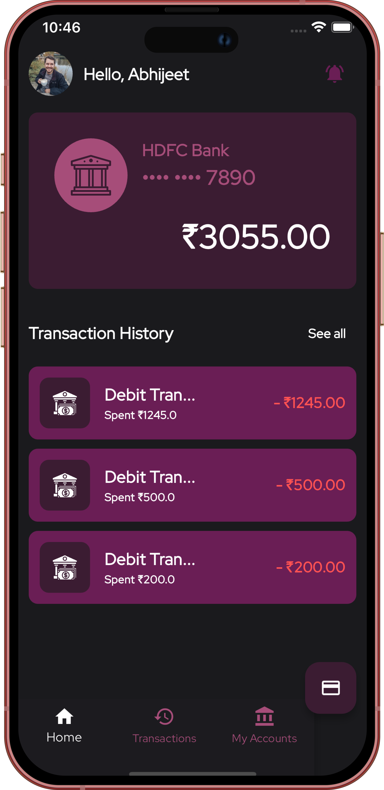
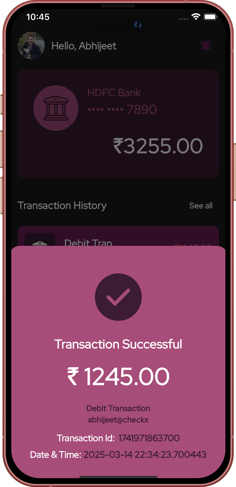
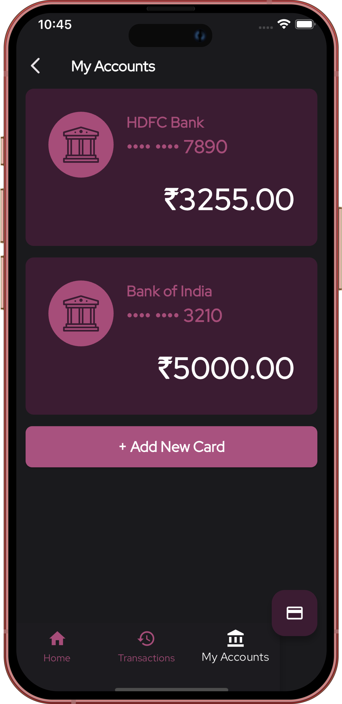
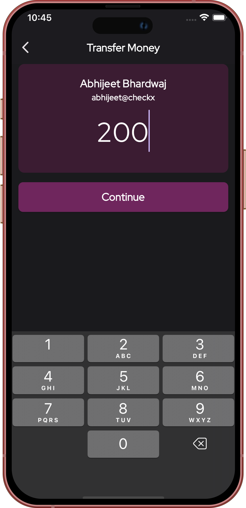
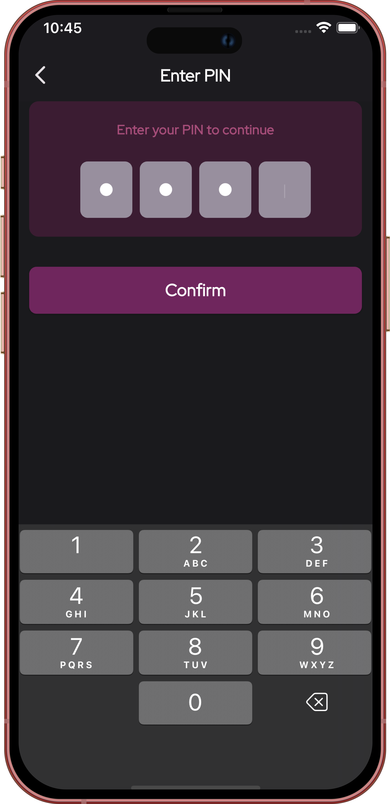
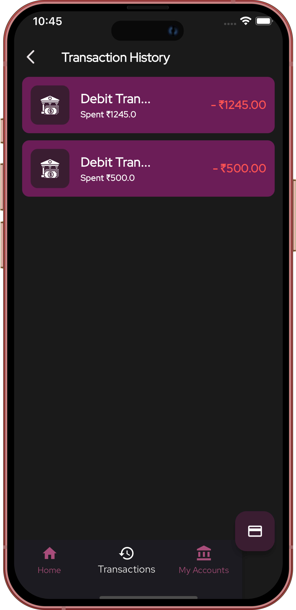

# Mobile Banking App Prototype


## Overview
This project is a prototype of a mobile banking application built using **Flutter**, with **Firebase as the backend** and **OAuth for authentication**. It includes secure user authentication, fund transfers, transaction history, push notifications, and payment gateway integration. The prototype is designed to simulate a high-traffic banking scenario with real-time financial data updates.

## Design & Documentation
- **MVP Document**: [MVP Requirements & Planning](https://docs.google.com/document/d/1paTY7YdeJwLSnHxx8ImD4FSsGlsrC6GEd-rMuIxACVU/edit?usp=sharing)
- **Figma UI Wireframes**: [Figma Design](https://www.figma.com/design/kznBKpGmWC5fS3mqmjiXdF/xnl-mobile-app?node-id=0-1&t=xIs15RYaXD1tSY6d-1)
- **Demo Video**: [Demo Video](https://drive.google.com/file/d/1cg1lKIJ1Pi8DkFwCb6M8JANkwEmxIHhO/view?usp=sharing)

## Screen Shots







---

## Developer Guide

1. To run this application follow below steps

```shell
git clone https://github.com/abhijeet-Bh/XNL-21BCB0139-MAD-1.git
```

2. go to project folder

```shell
cd checkx
```

3. install dependencies

```shell
flutter pub get
```

4. Run the application

```shell
flutter run
```

> Cheers, you'll have you app running :)

## Features
- **User Authentication**: OAuth-based login (Google, Apple, etc.).
- **Fund Transfer**: Secure money transfers between users.
- **Transaction History**: View past transactions with details.
- **Push Notifications**: Alerts for payments and account activities.
- **Real-time Market Data**: Fetch and display live financial data.
- **Payment Gateway Integration**: Simulated transactions using Stripe.

## Technology Stack
- **Frontend**: Flutter
- **Backend**: Firebase (Firestore, Authentication, Cloud Functions, Firebase Messaging)
- **Authentication**: OAuth
- **State Management**: Riverpod/Provider
- **Payment Gateway**: Stripe
- **Notifications**: Firebase Cloud Messaging (FCM)
